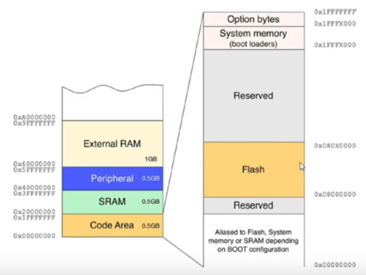

# Preguntas orientadoras

Describa brevemente los diferentes perfiles de familias de microprocesadores/microcontroladores de ARM. Explique alguna de sus diferenciascaracterísticas.

## Cortex M
### 1. Describa brevemente las diferencias entre las familias de procesadores Cortex M0, M3 y M4

Los procesadores ARM Cortex-M0, Cortex-M3 y Cortex-M4 pertenecen a la familia de procesadores ARM Cortex-M diseñados para sistemas embebidos y dispositivos de baja energía. Aunque comparten muchas características, hay diferencias notables entre ellos:

#### Cortex-M0:

a. **Eficiencia Energética**: Está diseñado para ser extremadamente eficiente en consumo de energía y tamaño, ideal para dispositivos de bajo costo y bajo consumo de energía.

b. **Conjunto de Instrucciones**: Tiene un conjunto de instrucciones reducido en comparación con otros núcleos Cortex-M.

c. **Arquitectura**: Basado en una arquitectura von Neumann de 32 bits.
 
d. **Rendimiento**: Menor rendimiento comparado con los otros modelos, pero suficiente para tareas simples.

e. **Sin Unidad de Punto Flotante (FPU)**: No tiene capacidad de realizar cálculos de punto flotante de hardware. 

f. **Sin instrucciones SIMD**: Sin Soporte para Instrucciones SIMD (Single Instruction, Multiple Data).

#### Cortex-M3:

a. **Equilibrio**: Ofrece un buen equilibrio entre rendimiento y eficiencia energética. 

b. **Conjunto de Instrucciones**: Tiene un conjunto de instrucciones más extenso que el Cortex-M0, lo que permite una mayor flexibilidad. 

c. **Arquitectura**: También basado en una arquitectura von Neumann de 32 bits. 

d. **Rendimiento**: Mayor rendimiento que el Cortex-M0 debido a características como pipeline de 3 etapas. 

e. **Sin Unidad de Punto Flotante (FPU)**: Al igual que el M0, no tiene FPU. 

f. **Sin instrucciones SIMD**: Sin Soporte para Instrucciones SIMD.

#### Cortex-M4:

a. **Rendimiento**: Está diseñado para aplicaciones que requieren cálculos matemáticos complejos y control digital de señales (DSP). 

b. **Conjunto de Instrucciones**: Aún más extenso, incluye instrucciones SIMD y otras optimizaciones. 

c. **Arquitectura**: También de 32 bits y basado en la arquitectura von Neumann. 

d. **Unidad de Punto Flotante (FPU)**: Opcionalmente, puede incluir una FPU para realizar cálculos de punto flotante de manera más eficiente. 

e. **Instrucciones SIMD**: Soporte para instrucciones SIMD para mejorar el rendimiento en operaciones paralelas.

### 2. ¿Por qué se dice que el set de instrucciones Thumb permite mayor densidad de código? Explique

El conjunto de instrucciones Thumb en la arquitectura ARM se diseñó con el objetivo de mejorar la densidad del código. Esto significa permitir que el código compilado ocupe menos espacio de memoria sin sacrificar demasiado rendimiento. A continuación se detallan algunas de las razones por las cuales Thumb logra una mayor densidad de código:

#### Instrucciones de 16 bits
Una de las características más notables del conjunto de instrucciones Thumb es que la mayoría de sus instrucciones son de 16 bits, en lugar de 32 bits como en el conjunto de instrucciones ARM tradicional. Esto significa que se puede almacenar más código en la misma cantidad de espacio de memoria.

#### Optimización para Operaciones Comunes
El conjunto de instrucciones Thumb está optimizado para las operaciones más comunes que se realizan en aplicaciones embebidas y sistemas de baja potencia. Al proporcionar instrucciones más cortas para operaciones frecuentes, se mejora la densidad del código.

#### Compatibilidad
Thumb es compatible con el conjunto de instrucciones ARM más grande, lo que permite a los programadores cambiar entre modos ARM y Thumb en tiempo de ejecución. Esto significa que los desarrolladores pueden usar instrucciones ARM de 32 bits para tareas computacionalmente intensivas y luego cambiar a Thumb para las partes del código donde la densidad y la eficiencia son más críticas.

#### Menor Ancho de Banda de Memoria
Debido a que las instrucciones son más pequeñas, se requiere menos ancho de banda de memoria para cargarlas, lo que a su vez puede llevar a un sistema más eficiente en términos de energía.

### 3. ¿Qué entiende por arquitectura load-store? ¿Qué tipo de instrucciones no posee este tipo de arquitectura?

 La arquitectura Load-Store es un tipo de diseño de conjunto de instrucciones (ISA, por sus siglas en inglés) en la que las instrucciones que realizan operaciones aritméticas o lógicas operan exclusivamente en registros del procesador, en lugar de directamente en la memoria. En esta arquitectura, las operaciones de carga (load) y almacenamiento (store) son las únicas que interactúan con la memoria. Este enfoque tiene varios beneficios, como facilitar la optimización del rendimiento y simplificar el diseño del procesador.

#### Instrucciones que no posee este tipo de arquitectura

La arquitectura Load-Store generalmente no posee instrucciones que combinan operaciones aritméticas o lógicas con operaciones de acceso a memoria en una sola instrucción. Por ejemplo, no tendrían instrucciones como las siguientes:

1. **Operaciones de Aritmética de Memoria**: Instrucciones que realizan una operación aritmética y almacenan el resultado directamente en la memoria.
2. **Instrucciones de Lógica de Memoria**: Instrucciones que toman un valor de la memoria, realizan una operación lógica y almacenan el resultado de nuevo en la memoria.
3. **Instrucciones de Manipulación de Memoria**: Instrucciones que mueven datos entre registros y memoria mientras también realizan alguna forma de procesamiento en los datos.

Estas instrucciones estarían presentes en arquitecturas más complejas que permiten operaciones entre registros y memoria en una única instrucción, pero en una arquitectura Load-Store, estas tareas se descompondrían en múltiples instrucciones: una para cargar datos de la memoria a un registro, una para realizar la operación en registros y una tercera para almacenar el resultado de nuevo en la memoria.

### 4. ¿Cómo es el mapa de memoria de la familia?

#### Mapa de Memoria de la Familia ARM Cortex-M

La familia de procesadores ARM Cortex-M posee un mapa de memoria uniforme y bien definido, lo que facilita la portabilidad del código y la consistencia en el diseño de sistemas embebidos. Esta es de 4G, que comienza en la direccion comienza en la dirección `0x00000000` y termina en la dirección `0xFFFFFFFF`, Aunque puede haber variaciones específicas según el microcontrolador en particular, el mapa de memoria generalmente se divide en varias regiones:

a) **Area de Código** Longitud de 512 MB, y sus direcciones van desde  `0x00000000` a `0xFFFFFFFF`. Esta area tiene 6 subbloques. 2 son reservados y los otrs cuatro son funcionales.

   i. **Primer subbloque** la primera subseccion es especial porque nos permite acceder a otros sub bloques, por ejempl al bloque de la Flash, al bolque de la memoria del sistema y al bloque de la RAM y eso depende de la configuracion que tenga el boot. El boot a nivel de HardWard esta compuesto por dos pines externos, al cual tendremos acceso y podemos darle diferente niveles de voltaje. Por ejemplo un valor logico alto o bajo. Dependiendo los valores logicos que le demos tendremos acceso a la Flash a la memoria del sistema o a la SRAM y ese acceso se va a dar en forma inmediata cualdo el microcontrolado se reinicia

   ii. **Memoria Flash**: Esta es donde generalmente se almacena el código del programa. Usualmente comienza en la dirección `0x08000000` o `0x00000000` dependiendo de la configuración de arranque del sistema. Termina de manera indeterminada ya que le da flexibilidad hasta donde llegara al fabricante. 
   
   iii. **Memoria de Sistema**: Espacio reservado para funciones específicas del sistema, como la tabla de vectores de interrupción, que generalmente se ubica cerca del inicio del mapa de memoria. Contiene el bootloader que permite escribir y leer en la Flash sin necesidad de un programador. Es decir, sin una piesa de hardware que actua como interfas que actua como interprete. Para programarlo  se pueden ocupar los puertos UART, CAN y USB.  Comienza en la dirección `0x01FFFX000`
   
   iiii. **Option bytes**: permiten configurar ciertas características del hardware que son leídas durante el arranque del microcontrolador o en tiempo de ejecución. Algunas de las configuraciones son Protección de Lectura y Escritura, Configuración de Arranque, Opciones de Hardware, Configuración de Periféricos, Niveles de Interrupción, Modo de Depuración, etc. Aqui hay opciones de poder bloquear la lectura de la flash para que evitar que copien nuestro programa.

	

  
2. **Memoria RAM**: Utilizada para datos y almacenamiento temporal durante la ejecución del programa, es decir se almacenan las variables. Comúnmente comienza en direcciones como `0x20000000`. Tiene una longitud de 0,5GB (máxima). 
  
3. **Registros de Periféricos**: Estos son mapeados en el espacio de direcciones para permitir la interacción con periféricos del microcontrolador como GPIO, UART, ADC, etc. Su posición en el mapa de memoria varía según el microcontrolador específico.
  
4. **Memoria Externa**: Algunos microcontroladores pueden soportar memoria externa, que también tendría su propio rango en el mapa de memoria. Se puede (1GB)

5. **Perifericos Externos**: Como memoria Flash  (1GB)
  
6. **Regiones No Asignadas**: Estas son áreas del mapa de memoria que no están asignadas ni reservadas, y acceder a ellas generalmente resultará en un comportamiento indefinido. Registros propios del microcontrolador. Como perifericos propios del microcontrolador.

Es fundamental comprender este mapa de memoria al diseñar software para microcontroladores basados en la arquitectura ARM Cortex-M, especialmente cuando se realizan operaciones a bajo nivel que requieren acceso directo a direcciones de memoria específicas.

5. ¿Qué ventajas presenta el uso de los “shadowed pointers” del PSP y el MSP?

6. Describa los diferentes modos de privilegio y operación del Cortex M, sus relaciones y como se conmuta de uno al otro. Describa un ejemplo en el que se pasa del modo privilegiado a no priviligiado y nuevamente a privilegiado.

7. ¿Qué se entiende por modelo de registros ortogonal? Dé un ejemplo

8. ¿Qué ventajas presenta el uso de intrucciones de ejecución condicional (IT)? Dé un ejemplo

9. Describa brevemente las excepciones más prioritarias (reset, NMI, Hardfault).

10. Describa las funciones principales de la pila. ¿Cómo resuelve la arquitectura el llamado a funciones y su retorno?

11. Describa la secuencia de reset del microprocesador.

12. ¿Qué entiende por “core peripherals”? ¿Qué diferencia existe entre estos y el resto de los periféricos?

13. ¿Cómo se implementan las prioridades de las interrupciones? Dé un ejemplo

14. ¿Qué es el CMSIS? ¿Qué función cumple? ¿Quién lo provee? ¿Qué ventajas aporta?

15. Cuando ocurre una interrupción, asumiendo que está habilitada ¿Cómo opera el microprocesador para atender a la subrutina correspondiente? Explique con un ejemplo

17. ¿Cómo cambia la operación de stacking al utilizar la unidad de punto flotante?

16. Explique las características avanzadas de atención a interrupciones: tail chaining y late arrival.

17. ¿Qué es el systick? ¿Por qué puede afirmarse que su implementación favorece la portabilidad de los sistemas operativos embebidos?

18. ¿Qué funciones cumple la unidad de protección de memoria (MPU)?

19. ¿Cuántas regiones pueden configurarse como máximo? ¿Qué ocurre en caso de haber solapamientos de las regiones? ¿Qué ocurre con las zonas de memoria no cubiertas por las regiones definidas?

20. ¿Para qué se suele utilizar la excepción PendSV? ¿Cómo se relaciona su uso con el resto de las excepciones? Dé un ejemplo

21. ¿Para qué se suele utilizar la excepción SVC? Expliquelo dentro de un marco de un sistema operativo embebido.

## ISA
1. ¿Qué son los sufijos y para qué se los utiliza? Dé un ejemplo

2. ¿Para qué se utiliza el sufijo ‘s’? Dé un ejemplo

3. ¿Qué utilidad tiene la implementación de instrucciones de aritmética saturada? Dé un ejemplo con operaciones con datos de 8 bits.

4. Describa brevemente la interfaz entre assembler y C ¿Cómo se reciben los argumentos de las funciones? ¿Cómo se devuelve el resultado? ¿Qué registros deben guardarse en la pila antes de ser modificados?

5. ¿Qué es una instrucción SIMD? ¿En qué se aplican y que ventajas reporta su uso? Dé un ejemplo.
